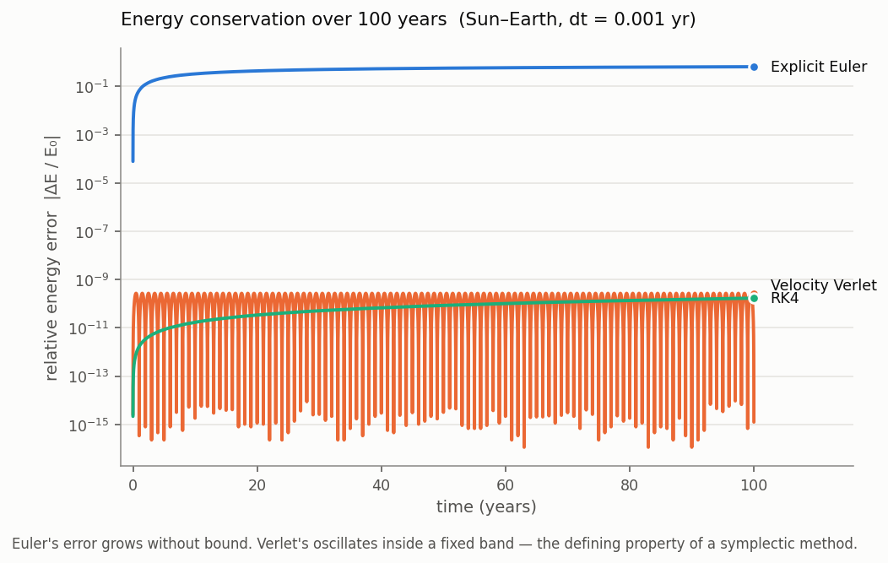
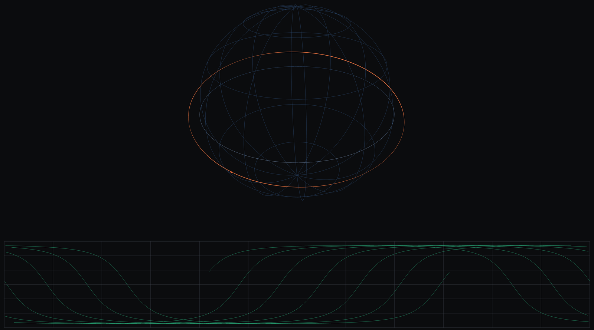
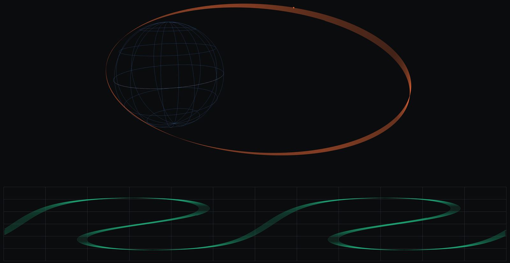
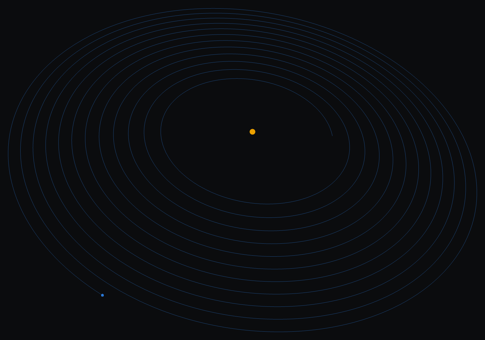

# physics-sims

[](https://github.com/rkdhruv/physics-sims/actions/workflows/ci.yml)

A gravitational simulation engine written from scratch in C++17 — numerical
integrators validated against conservation laws, satellite orbits with the J2
oblateness perturbation, and a real-time OpenGL renderer, cross-checked against
an independent Python implementation.



> **Status:** in active development. Two scenes run on the shared engine; the
> N-body and black-hole scenes are next. See [Scenes](#scenes).

---

## Why this exists

A simulated orbit that *looks* right is easy to produce and proves nothing. This
project started as a forward-Euler two-body integrator that drew a clean circle
at the correct radius with the correct period — and was silently wrong. It adds
energy every step, and over fifty simulated years the Earth spirals from 1.0 out
to 2.38 AU. Nothing in the picture says so.

So the organizing principle is measurement. Every claim the simulation makes is
backed by something checkable: a conserved quantity, a measured order of
convergence, an analytic rate, or a second implementation.

## Results

| Claim | How it's checked | Result |
|---|---|---|
| The integrators are the order they claim | Slope of log(error) vs log(dt) | 0.98 / 2.00 / 4.10 vs. theoretical 1 / 2 / 4 |
| The C++ engine matches the Python one | Same scenario, same timestep, 730 steps | agree to **7.4e-14 AU** |
| J2 perturbs orbits correctly | Propagated nodal precession vs. analytic secular rate | **0.06%** apart |
| Sun-synchronous orbits fall out of the physics | Inclination that precesses once per year | **98.2°**, derived not assumed |

That last one is the point of the whole exercise. A sun-synchronous orbit holds
a fixed angle to the Sun because Earth's equatorial bulge drags its orbital
plane around at exactly one turn per year. Here that inclination is *computed*
from the J2 model and confirmed by numerical propagation — 0.9851 deg/day
measured against the 0.9856 deg/day a year requires.

## Architecture

One engine, several scenes — not several unrelated demos.

```
core/          integrators, force models, orbital elements   (no OpenGL)
render/        window, shaders, camera, buffers              (no physics)
scenes/        orbital (heliocentric) and satellite (Earth)
validation/    Python harness — integrator comparison, energy plots
tests/         pytest suite + a dependency-free C++ suite
vendor/        glad (generated GL loader)
archive/       the original Python prototype this grew out of
```

`core/` links no graphics libraries, which keeps the physics testable without
opening a window. Physics enters through a `ForceModel` interface, so the same
integrators drive heliocentric N-body gravity and Earth-orbit-with-J2 without
knowing the difference — swapping the model is a one-line change at the call
site.

## Scenes

Both run on the same engine and the same renderer — the physics differs only by
which `ForceModel` is passed to the integrator.

### `satellite` — Earth orbits with J2



A sun-synchronous orbit at 700 km. The inclination is 98.2° — retrograde, which
is why these launches fly slightly west of south — and it isn't hardcoded: it's
the angle at which J2 drags the orbital plane around at exactly one turn per
year, solved for and then confirmed by propagation. The lower panel is the
ground track; successive passes march west because the Earth turns underneath a
plane that stays fixed in inertial space.



A Molniya orbit: highly eccentric, 12-hour period, at the 63.4° critical
inclination where J2's effect on the argument of perigee cancels out, so apogee
stays parked over the same hemisphere. The ground track's double loop is the
satellite dwelling near apogee for most of each orbit.

Press `1`/`2`/`3` for ISS, sun-synchronous, and Molniya; `J` toggles the
perturbation, and the title bar reports the orbital plane's drift since the run
started.

### `orbital` — integrator comparison



The same Sun–Earth system integrated with explicit Euler. Each loop should
retrace the last one exactly; instead the orbit gains energy every step and
spirals outward. Press `2` or `3` to switch to velocity Verlet or RK4, where the
loops collapse onto a single line.

Planned: an N-body cluster (Barnes-Hut, 10k+ bodies, instanced rendering) and a
black hole (geodesic raytracing in a fragment shader).

## Numerical methods

Three integrators, implemented and compared rather than assumed:

| Method | Order | Force evals/step | Long-run energy behavior |
|--------|-------|------------------|-------------------------|
| Explicit Euler | 1 | 1 | Grows without bound |
| Velocity Verlet | 2 | 2 | Bounded oscillation (symplectic) |
| RK4 | 4 | 4 | Slow monotonic drift |

Correctness is established by measuring each method's **empirical order of
convergence** — fitting the slope of log(error) against log(dt), which recovers
the theoretical order — rather than by eyeballing trajectories.

The C++ engine is additionally **cross-validated against the Python harness**:
both integrate the same scenario at the same timestep, and the trajectories are
required to agree to 1e-12 AU. They currently agree to 7.4e-14 AU over 730 steps
— around 11 metres across a 150-million-kilometre orbit. Two independent
implementations in two languages matching to that precision is a considerably
stronger correctness argument than either test suite passing alone.

The result worth reporting is that "which integrator is best" has no
context-free answer. At equal computational cost over 200 orbits, RK4 is roughly
20× more accurate than Verlet — the symplectic method does not simply win. But
Verlet's error is *flat* while RK4's climbs, so past a few thousand orbits the
ranking inverts. A five-year mission propagation wants RK4; a Gyr-scale
astrophysical run can only use the flat line.

[`validation/README.md`](validation/README.md) covers this in full.

## Orbital mechanics

The satellite scene models Earth orbits in kilometres and seconds, using the
gravitational parameter μ = 398600.4418 km³/s² rather than G and a mass — μ is
measured directly from spacecraft tracking and is known far more precisely than
either factor separately.

**J2** is the oblateness term. Earth is about 21 km wider across the equator
than pole to pole, so its gravity is not quite spherically symmetric. It is by
far the largest perturbation on a low orbit, and its effect is to rotate the
orbital plane:

| Orbit | Nodal precession, measured |
|---|---|
| ISS (420 km, 51.6°) | −4.97 °/day |
| Sun-synchronous (700 km, 98.2°) | +0.99 °/day |
| Molniya (63.4°, critical inclination) | −0.15 °/day |

The engine also converts state vectors to classical Keplerian elements, which is
what makes the perturbation measurable at all: `a`, `e` and `i` stay put while
the node and argument of periapsis drift, and that drift is invisible in a
position-versus-time plot.

## Building and running

```bash
brew install cmake glfw glm

cmake -S . -B build && cmake --build build -j8
./build/orbital        # integrator comparison, heliocentric
./build/satellite      # Earth orbits with J2 and a ground track
./build/core_tests     # 49 checks
```

Full controls and a sanitizer-build recipe are in [`BUILDING.md`](BUILDING.md).

The Python harness:

```bash
python3 -m venv venv && ./venv/bin/pip install numpy matplotlib pytest
./venv/bin/pytest                              # 34 tests
./venv/bin/python -m validation.make_figures   # writes figures/
```

## Units

Heliocentric scenes use AU, solar masses and years — which makes `G = 4π²` by
Kepler's third law, and Earth's orbital velocity exactly 2π AU/yr. Geocentric
scenes use km and seconds. Both are scaled rather than SI, which would put
positions near 1e11 and masses near 1e30 in the same expression and spend a
large share of a double's 15–16 significant digits on exponent range that
carries no information.
